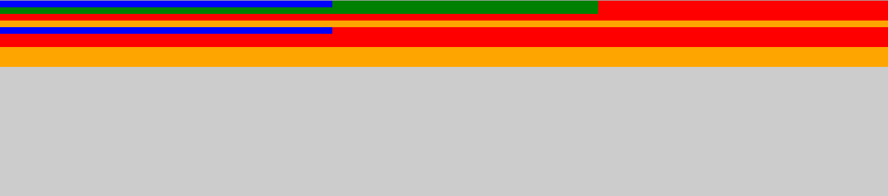

# Thinking in Divs

The whole point of this exercise is to expand how you think about divs. Divs are magical, you just aren't aware of their power yet. With time, you will learn :D

I have provided the html tags and the css selectors for you this time. It is your job to assign classes to the divs and add css to create the following:

## Properties Used

These are the properties that I used to create this example.

- background-color
- height
- margin-bottom
- width